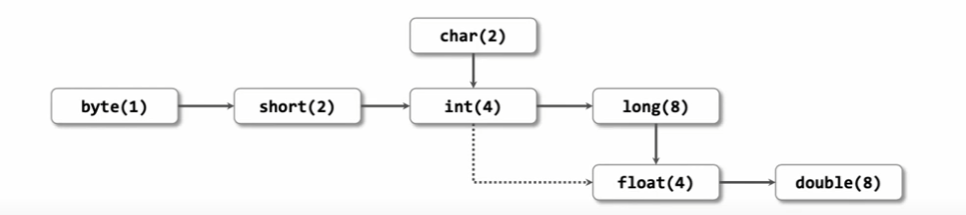

형변환 이란
각 변수의 자료형이 다를 때 자료형을 같게 바꾸는 것

구분
# 묵시적 형 변환 (자동 형 변환)
* Java 는 데이터가 손실되지 않거나, 손실이 제한적인 범위 내에서 암묵적으로 형을 변환합니다.
* 자료형이 다른 변수에 값을 할당하는 경우 (float f = 10;)
* 자료형이 다른 값을 연산하는 경우 (double d = 10.0 + 20;)

# 명시적 형 변환 (강제 형 변환)
* 명시적으로 형 변환하는 것을 캐스팅 이라고 합니다.
* 자동 형 변환 규칙에 위배되는 상황임에도 강제로 형 변환한 경우 데이터 손실의 위험이 있습니다.

기본 원칙
형 변환은 바이트 크기가 작은 자료형에서 큰 자료형으로 자동으로 이뤄집니다.
형 변환은 정밀하지 않은 자료형에서 더 정밀한 자료형을 자동으로 이뤄집니다.

[정수]
byte 1바이트 | 
short 2바이트 / char 2 바이트 | int 4 바이트 | long 8바이트
-> [실수] float 4 바이트 | double 8 바이트

왼쪽에서 오른쪽으로 형 변환이 이루어질 때는 자료 손실이 없지만, 표현 범위가 더 넓고 정밀하기 때문
오른쪽에서 왼쪽으로 형 변환이 이루어질 때는 자료 손실이 발생할 수 있다.