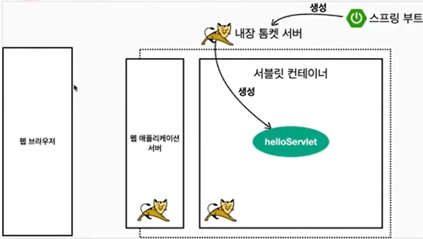
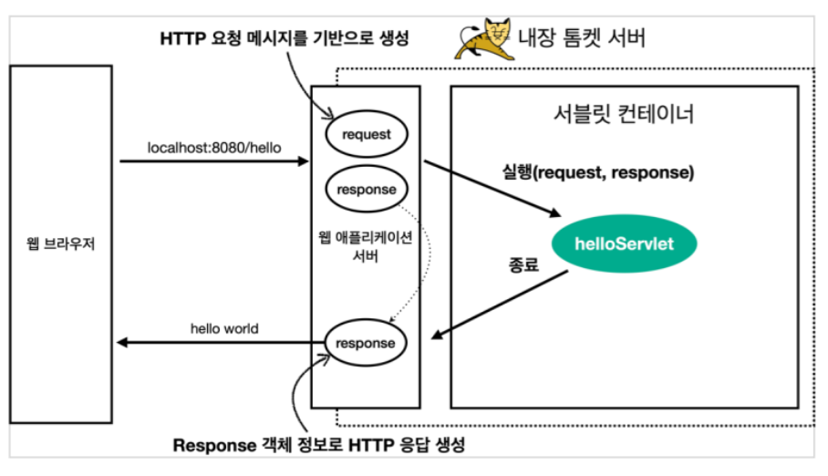
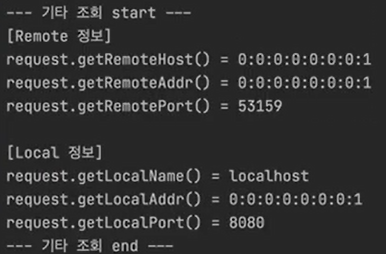
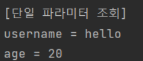
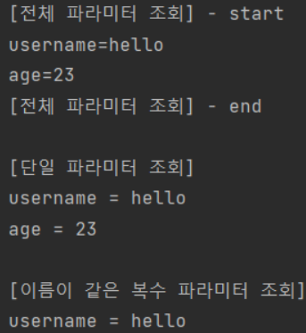
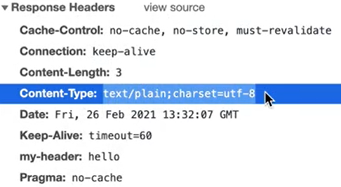
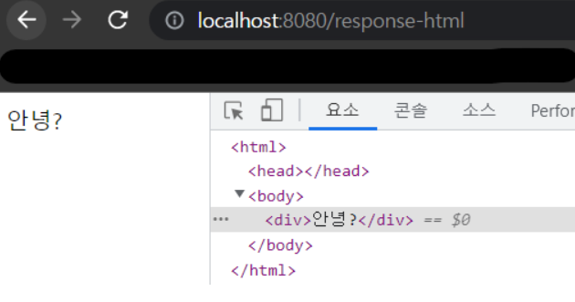
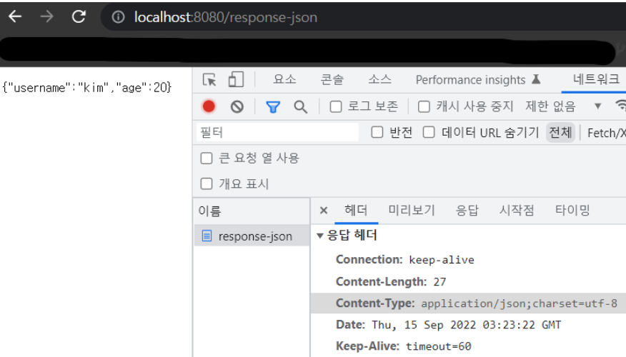

# 서블릿
>   클라이언트의 요청을 처리하고, 그 결과를 반환하는
Servlet 클래스의 구현 규칙을 지킨 자바 웹 프로그래밍 기술

## 프로젝트 생성


## Hello 서블릿
스프링 부트는 톰캣 서버를 내장하고 있으므로, 톰캣 서버 설치 없이 편리하게 서블릿 코드를 실행할 수 있다.

### 스프링 부트 서블릿 환경 구성
> `@ServletComponentScam`
>
> 스프링이 자동으로 내 패키지를 포함한 모든 하위패키지에 있는 서블릿을 찾아 자동으로 등록해주기 위해 @ServletComponentScan 어노테이션 추가

```
@ServletComponentScan // 서블릿 자동 등록
public class ServletApplication {

}
```

### 서블릿 등록하기
> `@WebServlet`
>
> 서블릿으로 등록하기 위하여 어노테이션 추가
> <br> name은 서블릿 이름, urlPatterns는 URL 매핑을 뜻한다.
>
> "/{urlPatterns}"이 호출되면, 서블릿 컨테이너는 해당 메서드를 실행한다.

HTTP 요청을 통해 매핑된 URL이 호출되면 서블릿 컨테이너는 다음 메서드를 실행한다.

```
@WebServlet(name = "helloServlet", urlPatterns = "/hello")
public class HelloServlet extends HttpSevlet {
    @Override
    protected void service(HttpServletRequest request,HttpServletResponse response) 
	throws ServletException, IOException {
        
        System.out.println("HelloServlet.service");
        System.out.println("request = " + request);
        System.out.println("response = " + response);
}
```

<div align='center'>
    
</div>

`HttpServletRequest`, `HttpServletResponse`는 인터페이스이다.
WAS 서버들이 Servlet 표준 스펙을 구현하는것 -> 구현체 존재, 찍히는 것은 구현체

#### request 요청 메시지

```
String username = request.getParameter("username");
```

서블릿은 `쿼리 파라미터`를 편리하게 받아올 수 있다.


#### response 응답 메시지

```
response.setContentType("text/plain");
response.setCharacterEncoding("utf-8");
response.getWriter().write("hello " + username); // HTTP 메시지 바디
```

`http://localhost:8080/hello?username=kim` 에 들어가 쿼리파라미터로 받은 값을 출력해보면 정상적으로 값을 받은 것을 확인할 수 있다.



스프링부트를 실행하면 내장 톰캣 서버를 띄워줌

서블릿 컨테이너를 통해 서블릿을 실행, helloServlet 생성됨


웹 브라우저가 HTTP 요청, 응답 메시지를 서버 측에 던져줌



서버는  request, response 객체를 만들어서 helloServlet을 호출해줌
거기에 서비스 메서드를 호출하면서 requset, response던져줌

그 후 서블릿이 종료되고 나가면서 WAS서버가 response정보를 가지고 HTTP 메세지를 만들어서 반환해줌

웹브라우저에서 볼 수 있음


## HttpServletRequest
> `HttepServletRequest`
>
> HTTP 요청 메시지를 개발자 대신 파싱하여 `HttpServletRequest` 객체에 담아 제공한다.

HTTP 요청 메시지
```
POST /save HTTP/1.1
Host: localhost:8080
Content-Type: application/x-www-form-urlencoded
username=kim&age=20
```

- **START LINE** : HTTP 메소드, URL, 쿼리 스트링, 스키마, 프로토콜
- **헤더** : 헤더 조회
- **바디** : form 파라미터 형식 조회, message body 데이터 직접 조회

### 부가적인 기능
**임시 저장소 기능**
- 해당 HTTP 요청이 시작부터 끝날 때까지 유지되는 임시 저장소 기능
    - 저장 : `request.setAttribute(name, value)`
    - 조회 : `request.getAttribute(name)`

**세션 관리 기능**
- `request.getSession(create:true);`

## HttpServletRequest 기본 사용방법

```
@WebServlet(name = "requestHeaderServlet", urlPatterns = "/request-header")
public class RequestHeaderServlet extends HttpServlet {

    @Override
    protected void service(HttpServletRequest request, HttpServletResponse response) throws ServletException, IOException {
        }
}
```

### START LINE정보
```
request.getMethod() // 메서드
request.getProtocol() // 프로트콜
request.getScheme() // 스키마
request.getRequestURL() // 요청 url
request.getRequestURI()  // 요청 uri
request.getQueryString() // 쿼리 파라미터
request.isSecure() // 보안(https)
```


### 헤더 정보
```
Enumeration<String> headerNames = request.getHeaderNames();
while (headerNames.hasMoreElements()) {
    String headerName = headerNames.nextElement();
    System.out.println(headerName + ": " + headerName);
}
```

```
request.getHeaderNames().asIterator()
                .forEachRemaining(headerName -> System.out.println(headerName + ": " + request.getHeader(headerName)));
```


#### 모든 헤더 정보가 아닌 원하는 정보만 얻고 싶을 경우
```
request.getServerName() // 이름
request.getServerPort() // 포트

request.getLocales().asIterator() // Accept-Language, 언어
                .forEachRemaining(locale -> System.out.println("locale = " + locale));
request.getLocale()

if (request.getCookies() != null) { // 쿠키
            for (Cookie cookie : request.getCookies()) {
                System.out.println(cookie.getName() + ": " + cookie.getValue());
            }
}

request.getContentType() // content 타입
request.getContentLength() // content 길이
request.getCharacterEncoding() // 인코딩
```


#### 그 외 기타정보
```
request.getRemoteHost()
request.getRemoteAddr()
request.getRemotePort()

request.getLocalName()
request.getLocalAddr()
request.getLocalPort()
```


## HTTP 요청 데이터
> HTTP 요청 메시지를 통해 클라이언트에서 서버로 데이터를 전달하는 방법에는 주로 3가지가 있다.

- **GET - 쿼리 파라미터**
    - /url?username=hello&age=20
    - 바디 없이 URL의 쿼리 파라미터에 데이터를 포함해 전달
    - ex) 검색, 필터, 페이징
- **POST - HTML Form**
    - content-type : application/x-www-form-urlencoded
    - 메시지 바디에 쿼리 파리미터 형식으로 전달
    - ex) 회원 가입, 상품 주문, HTML Form
- **HTTP message body**
    - HTTP API에서 주로 사용, JSON, XML, TEXT
    - 데이터 형식은 주로 JSON
    - POST, PUT, PATCH

## HTTP 요청 데이터 - GET 쿼리 파라미터
> 메시지 바디없이, URL의 `쿼리 파라미터`를 사용하여 데이터를 전달한다.
>
> `?`를 시작으로 보낼 수 있으며, 추가 파라미터는 `&`를 통해 구분된다.

### 1. 파라미터 전송 기능
`http://localhost:8080/request-param?username=hello&age=20`

#### 전체 파라미터 조회
```
@WebServlet(name="requestParamServlet", urlPatterns = "/request-param")
public class RequestParamServlet extends HttpServlet {
    
    @Override
    protected void service(HttpServletRequest request, HttpServletResponse response) throws ServletException, IOException {
        request.getParameterNames().asIterator()
                            .forEachRemaining(paramName -> System.out.println(paramName + "=" + request.getParameter(paramName)));
    }
}
```
username은 key, value는 getParameter를 통해 뽑아야함


#### 단일 파라미터 조회
```
String username = request.getParameter("username");
String age = request.getParameter("age");
```


#### 복수 파라미터 조회
`http://localhost:8080/request-param?username=hello&age=20&username=hello2 `
```
String[] usernames = request.getParameterValues("username");
for (String name : usernames) {
	System.out.println("username = " + name);
}
```


## HTTP 요청 데이터 - POST HTML Form
> Form을 통해 클라이언트에서 서버로 데이터를 전송한다.

**HTML Form**
- Content-Type: application/x-www-form-urlencoded
- 메시지 바디에 쿼리 파리미터 형식으로 데이터를 전달
- ex) username=hello&age=20




`application/x-www-form-urlencoded` 형식은 GET 쿼리 파라미터 형식과 같아, 위에서 만든 쿼리 파라미터 조회 메서드를 그대로 사용할 수 있다.

=> `request.getParameter()` 는 `GET URL 쿼리 파라미터`, `POST HTML Form` 둘 다 지원한다.

> **참고**
>
> content-type은 HTTP 메시지 바디의 데이터 형식을 지정한다.
>
> `GET URL 쿼리 파라미터 형식`은 HTTP 메시지 바디를 사용하지 않기 떄문에 content-type이 없다
>
> `POST HTML Form 형식`은 HTTP 메시지 바디에 해당 데이터를 포함하여 보내기 때문에 content-type을 지정해주어야 한다. 이렇게 폼으로 데이터를 전송하는 형식을 `application/x-www-form-urlencoded`라고 한다.

### Postman


Body는 `x-www-form-urlencoded` 선택

Headers에서 `content-type:application/x-www-form-urlencoded` 로 지정된 부분 꼭 확인

## HTTP 요청데이터 - API 메시지 바디
- HTTP message body에 데이터를 직접 담아서 요청
- HTTP API에서 주로 사용, 데이터 형식은 주로 JSON
- POST, PUT, PATCH

### 단순 텍스트 형태
```
@WebServlet(name = "requestBodyStringServlet", urlPatterns = "/request-body-string")
public class RequestBodyStringServlet extends HttpServlet {

    @Override
    protected void service(HttpServletRequest request, HttpServletResponse response) throws ServletExcetption, IOException {

        // body의 내용을 byte 코드로 가져옴
        ServletInputStream inputStream = request.getInputStream();

        // byte 코드를 string으로 바꿈
        String messageBody = StreamUtils.copyToString(inputStream, StandardCharsets.UTF_8);
    }
}
```

HTTP 요청 메시지의 메시지 body를 가져온다.


Postman에서 `content-type: text/plain`으로 요청할시 정상적으로 작동하는 것을 볼 수 있다.

### JSON
```
// lombok 라이브러리를 통해 getter, setter 코드 추가
@Getter @Setter
public class HelloData {
    private String username;
    private int age;
}
```

JSON 형태로 파싱할 수 있도록 `HelloData`라는 객체 생성

```
@WebServlet(name = "requestBodyJsonServlet", urlPatterns = "/request-body-json")
public class RequestBodyJsonServlet extends HttpServlet {

    // JSON 변환 라이브러리
    private ObjectMapper objectMapper = new ObjectMapper();

    @Override
    protected void service(HttpServletRequest request, HttpServletResponse response) throws ServletExcetption, IOException {

        HelloData helloData = objectMapper.readValue(messageBody, HelloData.class);
    }
}
```

JSON 결과를 파싱하여 객체로 변환하기 위하여 JSON 변환 라이브러리를 추가한다.

객체의 getter를 사용하여 값들을 출력한다.


## HttpServletResponse 기본 사용법
**HttpServletResponse 역할**
- HTTP 응답 메시지 생성: HTTP 응답코드 지정, 헤더 생성, 바디 생성
- 편의 기능 제공: Content-Type, 쿠키, Redirect

### HTTP 응답 메시지 생성
```
@WebServlet(name = "responseHeaderServlet", urlPatterns = "/response-header")
public class ResponseHeaderServlet extends HttpServlet {

    @Override
    protected void service(HttpServletRequest request, HttpServletResponse response) throws ServletExcetption, IOException {

        //[status-line]
        response.setStatus(HttpServletResponse.SC_OK); // http 응답코드 200

        //[response-headers]
        response.setHeader("Content-Type","text/plain;charset=utf-8");
        response.setHeader("Cache-Control", "no-cache, no-store, must-revalidate");
        response.setHeader("Pragma", "no-cache");
        response.setHeader("my-header","hello");

        //[message body]
        PrintWriter writer = response.getWriter();
        writer.println("ok");
    }
}
```

`http://localhost:8080/response-header`

작성한 응답 데이터들이 정상적으로 받은 것을 확인할 수 있다.


### 편의 기능 제공
```
//[Header 편의 메서드]
content(response);
cookie(resonse);
redirect(response);
```

```
private void content(HttpServletResponse response) {
    // Content 편의 메서드
    response.setContentType("text/plain");
    response.setCharacterEncoding("utf-8");
}

private void cookie(HttpServletResponse response) {
    // 쿠키 편의 메서드 
    Cookie cookie = new Cookie("myCookie", "good");
    cookie.setMaxAge(600); //600초
    response.addCookie(cookie);
}

private void redirect(HttpServletResponse response) {
    // redirect 편의 메서드
    // response.setStatus(HttpServletResponse.SC_FOUND); // 302
    // response.setHeader("Location", "/basic/hello-form.html");
    response.sendRedirect("/basic/hello-form.html");
} 
```



## HTTP 응답 데이터 - 단순 텍스트, HTML
```
@WebServlet(name = "responseHtmlServlet", urlPatterns = "/response-html")
public class ResponseHtmlServlet extends HttpServlet {

    @Ovierride
    protected void service(HttpServletRequest request, HttpServletResponse response) throws ServletException, IOException {
        // Content-Type : text/html;charset=utf-8
        response.setContentType("text/html");
        response.setCharacterEncoding("utf-8")

        PrintWriter writer = response.getWriter();
        writer.println("<html>");
        writer.println("<body>");
        writer.println(" <div>안녕?</div>");
        writer.println("</body>");
        writer.println("</html>");
    }
}
```



## HTTP 응답 데이터 - API JSON
```
@WebServlet(name = "responseJsonServlet", urlPatterns = "/response-json")
public class ResponseHtmlServlet extends HttpServlet {

    private ObjectMapper objectMapper = new ObjectMapper();

    @Ovierride
    protected void service(HttpServletRequest request, HttpServletResponse response) throws ServletException, IOException {
        // Content-Type : application/json
        response.setHeader("content-type", "application/json");
        response.setCharacterEncoding("utf-8");

        HelloData helloData = new HelloData();
        helloData.setUsername("kim");
        helloData.setAge(20);

        //{"username":"kim", "age":20}
        String result = objectMapper.writeValueAsString(helloData);
        response.getWriter().write(result);
    }
}
```



> **참고**
>
> `application/json`은 스펙 상 utf-8 형식을 사용하도록 정의되어 있다.
> 그래서 스펙에 charset=utf-8과 같은 추가 파라미터를 지원하지 않는다. 따라서 `application/json`이라고만 사용해야지, `application/json;charset=utf-8`이라고 전달하는 것은 의미없는 파라미터를 추가한 것이 된다.


### 참고자료
[스프링 MVC 1편 - 백엔드 웹 개발 핵심 기술](https://www.inflearn.com/course/%EC%8A%A4%ED%94%84%EB%A7%81-mvc-1/dashboard)

[[Spring] 스프링 MVC 1편 - 백엔드 웹 개발 핵심 기술 - 강의 정리 - 2](https://velog.io/@easyhyun00/Spring-%EC%8A%A4%ED%94%84%EB%A7%81-MVC-1%ED%8E%B8-%EB%B0%B1%EC%97%94%EB%93%9C-%EC%9B%B9-%EA%B0%9C%EB%B0%9C-%ED%95%B5%EC%8B%AC-%EA%B8%B0%EC%88%A0%EC%9C%A0%EB%A3%8C%EA%B0%95%EC%9D%98-2)
