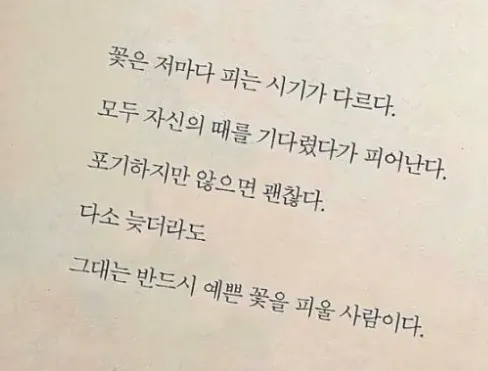

# 두부와 망고 스터디에 오신 것을 환영합니다!


# 🐶 두부와 망고 스터디

## 🎯 목표

- 스프링 마스터
- 취뽀

---

## 💌 두부와 망고의 도전일기

**두** 려움보다 한 걸음 더,

**부** 족함은 서로로 채우고,

**와** 락 다독인 말 한마디에

**망** 설임은 반으로 줄고,

**고** 된 밤도 함께라면 금세 아침.

**화** 사한 내일을 믿으며,

**이** 순간을 끝까지 밀어붙여,

**팅** 겨도 다시 도전! **두부와 망고, 파이팅!** 🌈

**“꽃은 때가 다르지만, 피지 않는 꽃은 없죠. 우리도 곧 만개할 거예요.” 🌸**



---


## 🏹 목표 달성 루틴

- 매주 일요일 9 to 9
- [ZEB에서 만나요😎](https://zep.us/play/R5M7mN)

---

<aside>


## 📣**정보**

```basic
- 인라인화 단축키
Ctrl + Alt + Shift + T 
command + option + N

- 2025/08/06 베이직반 메모
@ManyToOne(fetch = FetchType.Lazy)
@JoinColumn(name = `{현재클래스}_id`)
```


</aside>

---

<aside>


## 📌**메모**

```basic
정보탭 있는 거 너무 좋습니다~!

많이 채워봅시다🤭

```

</aside>

---

## 💛 우리 스터디원

[💛 우리 스터디원](https://www.notion.so/2426e4ecae5280318133d4d3503c9a3f?pvs=21)

## ⛳️  데일리 스크럼

| 이름  | 소개           | 달성 목표                                     |
|-----|--------------|-------------------------------------------|
| 강민영 |              |                                           |
| 김민형 | 😇 / 너무너무 피곤한 하루 | 인프런 section4까지 듣기, 월요일 스터디 준비하기, 회사 일 끝내기 |
| 김병수 | 😆/ 너무 좋아요!  | 자바에 대해 조금 더 깊게 알아가기                       |
| 김석준 |              |                                           |
| 김진희 |              |                                           |
| 박소영 |              |                                           |
| 박은지 |              |                                           |
| 박정은 |              |                                           |
| 백도현 |              |                                           |
| 이성호 |              |                                           |
| 이지호 |              |                                           |
| 이현경 |              |                                           |
| 이훈영 |              |                                           |
| 최지나 | 😀/ 잠이들깸     | 복습 끝내기                                    |

